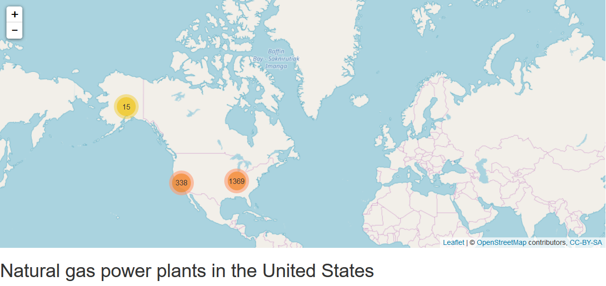
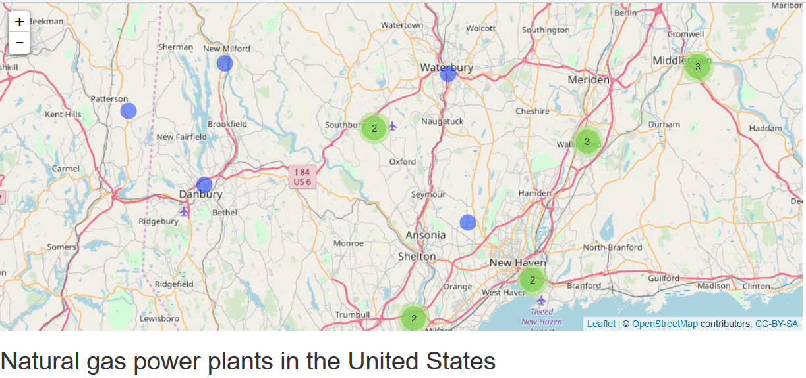

## Application overview
```{r, echo=FALSE}
htmltools::HTML("
<div style='text-align: center;'>
    
</div>")
```

### What is it for?

The application shows the locations of the electric power plants in the United States segmented by their primary energy source.

### How to use it?

1) : From the dropdown list on the left, select the primary energy source.

2) : The leaflet map diplays each power plant as a blue circle. If the markers are near each other they are grouped as a cluster.


## Data source
The U.S. Energy Information Administration has a dataset of 8940 electric power plants in the U.S. There is information about the location of each plant, its capacity and primary source.

```{r}
power_plants <- foreign::read.dbf("PowerPlants_US_201810.dbf")
print(dim(power_plants))
print(as.character(unique(power_plants$PrimSource)))
```

## Map: clusters 1/2

```{r, echo=FALSE}
htmltools::HTML("<div style='text-align: center;'>
    
</div>")
```

The interactive map diplays each location of a power plant with a blue circle. 
The markers that are near each other are grouped as a cluster. In this case there are three main clusters...

## Map: clusters 2/2

```{r, echo=FALSE}
htmltools::HTML("<div style='text-align: center;'>
    
</div>")
```


... to see each individual location, zoom in.

